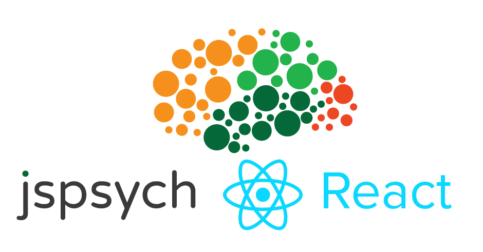

<!-- Logo -->
<p align="center">
    
</p>

# Getting Started

`npm install jspsych-react`

You can use the `ExperimentWindow` component to include a jsPsych experiment in your React project. For example:

```javascript
import React, { Component } from 'react'
import { ExperimentWindow } from "jspsych-react";
import { visualOddball } from "./your_experiments/experiment_timeline";
import { callbackHTMLDisplay, callbackImageDisplay } from "./custom_plugins/plugins";

export default class ExperimentWindow extends Component {
  render() {
    return (
      <div>
        <ExperimentWindow
          settings={{ timeline: visualOddball }}
          plugins={{
            "callback-html-display": callbackHTMLDisplay,
            "callback-image-display": callbackImageDisplay
          }}
        />
      </div>
    );
  }
}
```

You can also import the jsPsych object to access other jsPsych functionalities, such as updating the progress bar during a jsPsych experiment. For example:

```javascript
import { jspsych } from "jspsych-react";

export const updateProgress = () =>
  jsPsych.setProgressBar(
    jsPsych.progress().current_trial_global / jspsychObject.sample.size
  );
```

# API

## Props

### Experiment

| Name     | Type     | Default    | Description                                                                                                                                                                                                                                                                                         |
| -------- | -------- | ---------- | --------------------------------------------------------------------------------------------------------------------------------------------------------------------------------------------------------------------------------------------------------------------------------------------------- |
| settings | `object` | `required` | The settings object is passed to the `jsPsych.init()` function and defines many aspects of an experiment. It can contain many parameters, but the only _required_ parameter is a timeline. See the the [jsPsych API documentation](https://www.jspsych.org/core_library/jspsych-core/#jspsychinit). |
| plugins  | `object` | `null`     | Custom plugins to be passed to jsPsych for use in the experiment. Object keys should match the names of the plugins referenced in the timeline.

# License
MIT © [Teon L Brooks](https://teonian.com/)
